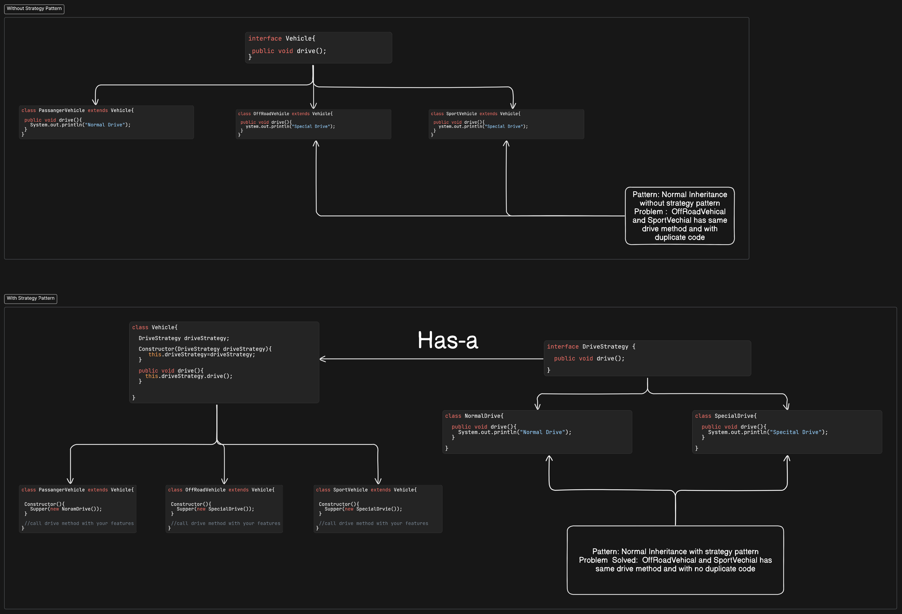

# Strategy Design Pattern

- This Design pattern used when child components/class share the same/duplicate functionality. If there is duplicate
  code with inheritance functionality within child class.
- To implement Strategy Design pattern we have to create interface for functionality. it needs to be implement with
  there special features. this implemented interface need to be passed with constructor of inherited classes.

# COde

