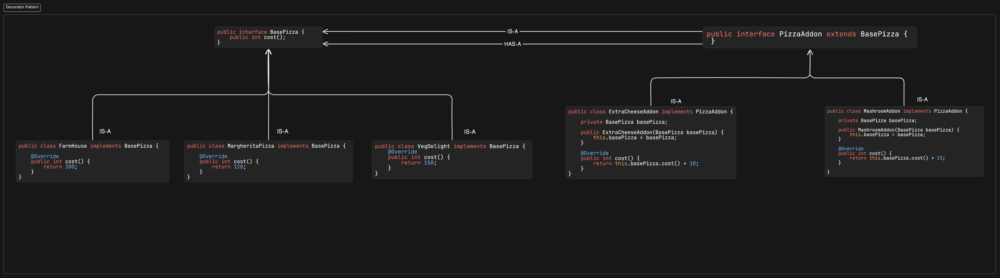

# Decorator Design Pattern

- Decorator pattern used when if we want add features/addon on base component.
- Ex. Pizza with extra cheese , double cheese.
- Ex. Base care with addon features like Music system , fog lamp etc.
- We can used this pattern while we want to add features with multiple combination of features
- If want to perform chain of operation on base data with construction injection.

# COde

